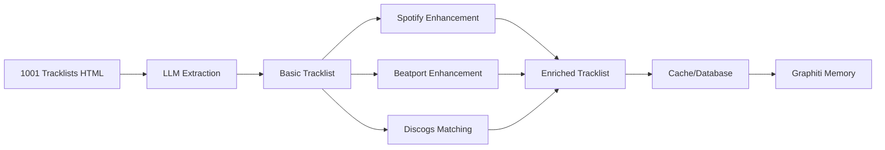

# 1001 Tracklists Integration Design

## Overview

1001 Tracklists is the world's leading DJ tracklist database with 420,000+ tracklists. Since there's no official API, we need a modern scraping solution that leverages LLMs for intelligent data extraction.

## Current Landscape

### No Official API
- 1001 Tracklists doesn't provide a public API
- Existing solutions rely on web scraping with BeautifulSoup
- Community has built unofficial scrapers with limited functionality

### Existing Implementation Limitations
- Basic HTML parsing with fixed selectors (fragile)
- No captcha handling
- No rate limiting or proxy rotation
- Limited data extraction (missing BPM, key, etc.)
- No integration with other music services

## Modern Approach with LLMs

### 1. Intelligent HTML Parsing
Instead of fixed CSS selectors that break with UI changes:
```python
# Traditional approach (fragile)
track_name = soup.find('span', class_='trackname').text

# Modern LLM approach (resilient)
track_info = llm.extract_structured_data(
    html_content,
    schema=TrackSchema,
    context="Extract DJ set tracklist information"
)
```

### 2. Multi-Modal Track Identification
Use LLMs to:
- Extract track names even from partial/unclear text
- Identify "ID - ID" tracks and suggest possible matches
- Parse timestamps and mixing notation (e.g., "w/", "into", "over")
- Handle various format variations

### 3. Enhanced Data Extraction

#### Tracklist Data Structure
```python
class Tracklist:
    id: str
    url: str
    event_name: str
    dj_name: str
    date: datetime
    venue: str
    location: str
    duration: int  # minutes
    genres: List[str]
    tags: List[str]
    play_count: int
    favorite_count: int
    tracks: List[Track]
    recording_url: Optional[str]  # SoundCloud/Mixcloud link
```

#### Track Data Structure
```python
class Track:
    position: int
    timestamp: Optional[str]
    artist: str
    title: str
    remix: Optional[str]
    label: Optional[str]
    mix_type: Optional[str]  # "w/", "into", "over"
    bpm: Optional[float]
    key: Optional[str]
    genre: Optional[str]
    is_id: bool  # Unknown/unreleased track
    beatport_url: Optional[str]
    spotify_uri: Optional[str]
    confidence: float  # LLM confidence score
```

### 4. Integration Architecture

```python
class OneThousandOneTracklistsIntegration:
    """Modern 1001 Tracklists integration using LLMs."""
    
    def __init__(self):
        self.session = self._create_session()
        self.llm = self._initialize_llm()
        self.cache = RedisCache()
        self.rate_limiter = RateLimiter(requests_per_minute=30)
        
    async def get_tracklist(self, url: str) -> Tracklist:
        """Fetch and parse a tracklist with LLM enhancement."""
        # Check cache first
        if cached := await self.cache.get(url):
            return cached
            
        # Rate limiting
        await self.rate_limiter.wait()
        
        # Fetch HTML
        html = await self._fetch_with_retry(url)
        
        # LLM extraction
        tracklist = await self.llm.extract_tracklist(html)
        
        # Enhance with external data
        tracklist = await self._enhance_tracks(tracklist)
        
        # Cache result
        await self.cache.set(url, tracklist, ttl=3600)
        
        return tracklist
        
    async def _enhance_tracks(self, tracklist: Tracklist):
        """Enhance tracks with BPM, key, and streaming links."""
        for track in tracklist.tracks:
            # Try to find on Spotify
            if spotify_track := await self.spotify.search_track(
                f"{track.artist} {track.title}"
            ):
                track.bpm = spotify_track.audio_features.tempo
                track.key = spotify_track.audio_features.key
                track.spotify_uri = spotify_track.uri
                
            # Try Beatport for electronic music
            if beatport_track := await self.beatport.search(
                track.artist, track.title
            ):
                track.beatport_url = beatport_track.url
                track.genre = beatport_track.genre
                
        return tracklist
```

### 5. Advanced Features

#### A. Festival/Event Analysis
```python
async def analyze_festival(self, festival_url: str):
    """Analyze all sets from a festival."""
    sets = await self.get_festival_sets(festival_url)
    
    return {
        'most_played_tracks': self._get_top_tracks(sets),
        'bpm_progression': self._analyze_bpm_patterns(sets),
        'genre_distribution': self._analyze_genres(sets),
        'artist_connections': self._build_artist_graph(sets)
    }
```

#### B. DJ Style Analysis
```python
async def analyze_dj_style(self, dj_name: str):
    """Analyze a DJ's mixing style and track selection."""
    recent_sets = await self.get_dj_sets(dj_name, limit=20)
    
    return {
        'avg_bpm': self._calculate_avg_bpm(recent_sets),
        'key_progression': self._analyze_harmonic_mixing(recent_sets),
        'genre_preferences': self._get_genre_distribution(recent_sets),
        'exclusive_tracks': self._find_signature_tracks(recent_sets),
        'mixing_patterns': self._analyze_transitions(recent_sets)
    }
```

#### C. Track Discovery
```python
async def discover_tracks(self, criteria: DiscoveryCriteria):
    """Discover new tracks based on criteria."""
    # Find tracks played by multiple DJs
    # Identify rising tracks (increasing play frequency)
    # Find tracks similar to user preferences
    pass
```

### 6. Integration with Existing Music Agent

#### Mapping to Existing Models
```python
# In music_agent/models/ontologies.py
class DJSet(BaseModel):
    """Represents a DJ set/mix."""
    tracklist_url: Optional[str]
    tracks: List[Track]
    mixing_data: Dict[str, Any]  # BPM curves, key progressions
    
# Extend existing Track model
class Track(BaseModel):
    # ... existing fields ...
    dj_play_count: int  # How many DJs have played this
    first_played: Optional[datetime]
    peak_time_track: bool  # Often played at set climax
```

#### Agent Tools
```python
# music_agent/tools/tracklists_tools.py

@tool
def get_dj_tracklist(url: str) -> Tracklist:
    """Fetch a DJ set tracklist from 1001 Tracklists."""
    
@tool
def find_track_in_sets(artist: str, title: str) -> List[TrackAppearance]:
    """Find all DJ sets that played a specific track."""
    
@tool
def analyze_festival_trends(festival: str, year: int) -> FestivalAnalysis:
    """Analyze music trends from a festival."""
    
@tool
def discover_underground_tracks(genre: str, timeframe: str) -> List[Track]:
    """Discover underground tracks gaining momentum."""
    
@tool 
def get_dj_signature_tracks(dj_name: str) -> List[Track]:
    """Get tracks frequently played by a specific DJ."""
```

### 7. Technical Implementation

#### Captcha Handling
- Use residential proxies for rotation
- Implement exponential backoff
- Consider using captcha solving services if needed

#### Rate Limiting
- Respect site limits (30 requests/minute suggested)
- Implement request queuing
- Cache aggressively (Redis/local)

#### LLM Optimization
- Use structured output schemas
- Implement confidence scoring
- Fall back to traditional parsing for simple cases
- Batch process multiple pages

### 8. Data Enrichment Pipeline



### 9. Advantages of Modern Approach

1. **Resilience**: LLM parsing adapts to HTML changes
2. **Intelligence**: Handles unclear/partial track info
3. **Enrichment**: Automatic BPM/key/link enhancement
4. **Analysis**: Advanced DJ/festival insights
5. **Integration**: Seamless with existing music agent
6. **Caching**: Reduced load on target site
7. **Discovery**: Find trending/underground tracks

### 10. Ethical Considerations

- Respect robots.txt
- Implement reasonable rate limits
- Cache to minimize requests
- Consider reaching out to 1001 Tracklists for partnership
- Attribute data source properly

## Next Steps

1. Implement core scraping with LLM extraction
2. Build enrichment pipeline with Spotify/Beatport
3. Create analysis tools for DJ styles and festivals
4. Integrate with Graphiti memory for relationship mapping
5. Add discovery algorithms for track recommendations