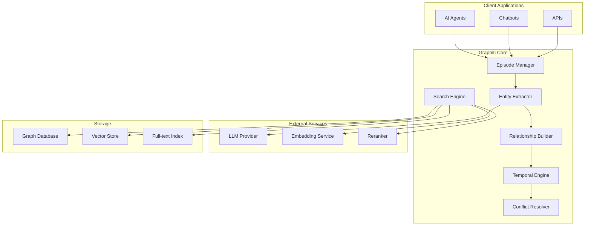

# Technical Architecture Deep Dive

## Table of Contents
1. [System Architecture](#system-architecture)
2. [Core Components](#core-components)
3. [Episode Processing Pipeline](#episode-processing-pipeline)
4. [Temporal Data Model](#temporal-data-model)
5. [Search and Retrieval System](#search-and-retrieval-system)
6. [LLM Integration Layer](#llm-integration-layer)
7. [Database Layer](#database-layer)

---

## System Architecture

### High-Level Architecture



### Component Interactions

The Graphiti architecture follows a modular design where each component has a specific responsibility:

1. **Episode Manager**: Entry point for all data ingestion
2. **Entity Extractor**: Uses LLMs to identify entities and relationships
3. **Relationship Builder**: Constructs graph edges with temporal metadata
4. **Temporal Engine**: Manages validity periods and historical tracking
5. **Search Engine**: Orchestrates hybrid retrieval strategies
6. **Conflict Resolver**: Handles contradictions and updates

---

## Core Components

### 1. Episode Manager

The Episode Manager is responsible for:
- Accepting various input formats (text, JSON, structured data)
- Maintaining episode metadata
- Orchestrating the extraction pipeline

```python
class EpisodeManager:
    async def add_episode(
        self,
        name: str,
        episode_body: str | dict,
        source: EpisodeType,
        source_description: str,
        reference_time: datetime,
        group_id: str | None = None
    ) -> EpisodicNode:
        """
        Process and store an episode in the knowledge graph.
        
        Steps:
        1. Create episodic node
        2. Extract entities and relationships
        3. Resolve conflicts
        4. Update graph indices
        """
        # Implementation details...
```

### 2. Entity Extractor

Leverages LLMs with structured output to extract:
- **Entities**: People, places, concepts, custom types
- **Attributes**: Properties of entities
- **Relationships**: Connections between entities

```python
class EntityExtractor:
    def __init__(self, llm_client: LLMClient):
        self.llm_client = llm_client
        
    async def extract_entities(
        self,
        text: str,
        entity_types: list[type[BaseModel]] | None = None
    ) -> list[ExtractedEntity]:
        """
        Extract entities using LLM with structured output.
        
        Uses few-shot prompting and type hints to ensure
        consistent extraction.
        """
        prompt = self._build_extraction_prompt(text, entity_types)
        response = await self.llm_client.generate_structured(
            prompt,
            response_model=EntityExtractionResponse
        )
        return response.entities
```

### 3. Relationship Builder

Constructs edges with full temporal metadata:

```python
class RelationshipBuilder:
    def build_edge(
        self,
        source_node: EntityNode,
        target_node: EntityNode,
        relationship: str,
        reference_time: datetime,
        extracted_facts: list[str]
    ) -> EntityEdge:
        """
        Create an edge with temporal validity.
        
        Handles:
        - Setting initial validity period
        - Generating edge embeddings
        - Creating fact summaries
        """
        edge = EntityEdge(
            source_node_uuid=source_node.uuid,
            target_node_uuid=target_node.uuid,
            fact=self._generate_fact_summary(extracted_facts),
            valid_at=reference_time,
            invalid_at=None,  # Open-ended validity
            created_at=utc_now()
        )
        return edge
```

### 4. Temporal Engine

Manages the bi-temporal aspects of the graph:

```python
class TemporalEngine:
    async def process_temporal_update(
        self,
        new_edge: EntityEdge,
        existing_edges: list[EntityEdge]
    ) -> list[EntityEdge]:
        """
        Handle temporal conflicts and updates.
        
        Algorithm:
        1. Find conflicting edges
        2. Determine invalidation strategy
        3. Update validity periods
        4. Preserve historical record
        """
        updated_edges = []
        
        for existing in existing_edges:
            if self._is_conflicting(new_edge, existing):
                # Mark old edge as invalid
                existing.invalid_at = new_edge.valid_at
                updated_edges.append(existing)
        
        # Add new edge with proper validity
        updated_edges.append(new_edge)
        return updated_edges
```

---

## Episode Processing Pipeline

### Pipeline Stages

```python
async def process_episode_pipeline(episode: RawEpisode) -> ProcessedEpisode:
    """
    Complete pipeline for processing an episode.
    """
    # Stage 1: Parse and Validate
    parsed = await parse_episode(episode)
    
    # Stage 2: Extract Entities (Parallel)
    entities = await extract_entities_parallel(parsed.chunks)
    
    # Stage 3: Resolve Entities (Deduplication)
    resolved_entities = await resolve_entities(entities)
    
    # Stage 4: Extract Relationships
    relationships = await extract_relationships(
        parsed.chunks,
        resolved_entities
    )
    
    # Stage 5: Apply Temporal Logic
    temporal_edges = await apply_temporal_logic(relationships)
    
    # Stage 6: Generate Embeddings (Parallel)
    embeddings = await generate_embeddings_parallel(
        resolved_entities + temporal_edges
    )
    
    # Stage 7: Persist to Graph
    result = await persist_to_graph(
        resolved_entities,
        temporal_edges,
        embeddings
    )
    
    return result
```

### Parallel Processing Strategy

```python
import asyncio
from typing import List, Tuple

async def extract_entities_parallel(
    chunks: List[str],
    max_concurrent: int = 10
) -> List[ExtractedEntity]:
    """
    Process chunks in parallel with concurrency control.
    """
    semaphore = asyncio.Semaphore(max_concurrent)
    
    async def process_chunk(chunk: str) -> List[ExtractedEntity]:
        async with semaphore:
            return await extract_entities(chunk)
    
    # Create tasks for all chunks
    tasks = [process_chunk(chunk) for chunk in chunks]
    
    # Execute in parallel
    results = await asyncio.gather(*tasks)
    
    # Flatten results
    all_entities = []
    for chunk_entities in results:
        all_entities.extend(chunk_entities)
    
    return all_entities
```

### Entity Resolution Algorithm

```python
class EntityResolver:
    async def resolve_entities(
        self,
        extracted: List[ExtractedEntity],
        existing: List[EntityNode]
    ) -> Tuple[List[EntityNode], List[EntityNode]]:
        """
        Deduplicate and merge entities.
        
        Strategy:
        1. Exact name matching
        2. Fuzzy matching with threshold
        3. Embedding similarity for ambiguous cases
        4. LLM verification for critical matches
        """
        new_entities = []
        merged_entities = []
        
        for extracted_entity in extracted:
            # Try exact match
            exact_match = self._find_exact_match(
                extracted_entity,
                existing
            )
            
            if exact_match:
                merged = self._merge_attributes(
                    exact_match,
                    extracted_entity
                )
                merged_entities.append(merged)
                continue
            
            # Try fuzzy match
            fuzzy_matches = self._find_fuzzy_matches(
                extracted_entity,
                existing,
                threshold=0.85
            )
            
            if fuzzy_matches:
                # Use embeddings to verify
                best_match = await self._verify_with_embeddings(
                    extracted_entity,
                    fuzzy_matches
                )
                if best_match:
                    merged = self._merge_attributes(
                        best_match,
                        extracted_entity
                    )
                    merged_entities.append(merged)
                    continue
            
            # No match found - create new entity
            new_entity = self._create_entity_node(extracted_entity)
            new_entities.append(new_entity)
        
        return new_entities, merged_entities
```

---

## Temporal Data Model

### Bi-Temporal Schema

```python
@dataclass
class TemporalEdge:
    """
    Edge with bi-temporal tracking.
    """
    # Identity
    uuid: str
    source_node_uuid: str
    target_node_uuid: str
    
    # Temporal dimensions
    valid_at: datetime      # When fact became true
    invalid_at: datetime | None  # When fact ceased to be true
    created_at: datetime    # When recorded in system
    updated_at: datetime    # Last modification time
    
    # Content
    fact: str              # Human-readable fact
    confidence: float      # Extraction confidence
    provenance: str        # Source episode UUID
```

### Temporal Query Examples

```python
class TemporalQueries:
    async def point_in_time_query(
        self,
        node_uuid: str,
        timestamp: datetime
    ) -> List[EntityEdge]:
        """
        Get all relationships valid at a specific time.
        """
        query = """
        MATCH (n:Entity {uuid: $node_uuid})-[r:RELATES_TO]->(m:Entity)
        WHERE r.valid_at <= $timestamp 
        AND (r.invalid_at IS NULL OR r.invalid_at > $timestamp)
        RETURN r
        """
        return await self.driver.execute(query, {
            'node_uuid': node_uuid,
            'timestamp': timestamp
        })
    
    async def temporal_evolution_query(
        self,
        node_uuid: str,
        start_time: datetime,
        end_time: datetime
    ) -> List[TemporalChange]:
        """
        Track how relationships changed over a time period.
        """
        query = """
        MATCH (n:Entity {uuid: $node_uuid})-[r:RELATES_TO]->(m:Entity)
        WHERE (r.valid_at >= $start_time AND r.valid_at <= $end_time)
           OR (r.invalid_at >= $start_time AND r.invalid_at <= $end_time)
        RETURN r, 
               CASE 
                   WHEN r.valid_at >= $start_time THEN 'ADDED'
                   WHEN r.invalid_at <= $end_time THEN 'REMOVED'
                   ELSE 'MODIFIED'
               END as change_type
        ORDER BY r.valid_at
        """
        return await self.driver.execute(query, {
            'node_uuid': node_uuid,
            'start_time': start_time,
            'end_time': end_time
        })
```

### Conflict Resolution Strategies

```python
class ConflictResolver:
    async def resolve_conflict(
        self,
        new_fact: EntityEdge,
        existing_facts: List[EntityEdge],
        strategy: ConflictStrategy = ConflictStrategy.TEMPORAL_OVERRIDE
    ) -> List[EntityEdge]:
        """
        Resolve conflicts between facts.
        """
        if strategy == ConflictStrategy.TEMPORAL_OVERRIDE:
            # Newer facts invalidate older ones
            for existing in existing_facts:
                if self._is_contradictory(new_fact, existing):
                    existing.invalid_at = new_fact.valid_at
        
        elif strategy == ConflictStrategy.CONFIDENCE_BASED:
            # Higher confidence facts take precedence
            if new_fact.confidence > max(e.confidence for e in existing_facts):
                for existing in existing_facts:
                    existing.invalid_at = new_fact.valid_at
            else:
                # Don't add new fact if confidence is lower
                return existing_facts
        
        elif strategy == ConflictStrategy.SOURCE_AUTHORITY:
            # Certain sources have higher authority
            source_rank = self._get_source_authority(new_fact.provenance)
            for existing in existing_facts:
                existing_rank = self._get_source_authority(existing.provenance)
                if source_rank > existing_rank:
                    existing.invalid_at = new_fact.valid_at
        
        return existing_facts + [new_fact]
```

---

## Search and Retrieval System

### Hybrid Search Architecture

```python
class HybridSearchEngine:
    def __init__(
        self,
        embedder: EmbedderClient,
        reranker: CrossEncoderClient,
        graph_driver: GraphDriver
    ):
        self.embedder = embedder
        self.reranker = reranker
        self.driver = graph_driver
    
    async def search(
        self,
        query: str,
        config: SearchConfig
    ) -> SearchResults:
        """
        Execute hybrid search with multiple strategies.
        """
        # Generate query embedding
        query_embedding = await self.embedder.embed(query)
        
        # Execute search strategies in parallel
        results = await asyncio.gather(
            self._semantic_search(query_embedding, config),
            self._keyword_search(query, config),
            self._graph_search(query, config)
        )
        
        # Merge and deduplicate
        merged = self._merge_results(results, config.fusion_method)
        
        # Rerank if configured
        if config.use_reranking:
            merged = await self._rerank_results(query, merged)
        
        return SearchResults(
            edges=merged[:config.limit],
            total_count=len(merged),
            search_config=config
        )
```

### Search Configuration Recipes

```python
# Pre-configured search strategies
EDGE_HYBRID_SEARCH_RRF = SearchConfig(
    search_methods=[
        SemanticSearchMethod(weight=0.4, similarity_threshold=0.7),
        KeywordSearchMethod(weight=0.3, use_synonyms=True),
        GraphTraversalMethod(weight=0.3, max_depth=2)
    ],
    fusion_method=FusionMethod.RECIPROCAL_RANK,
    use_reranking=True,
    limit=20
)

NODE_FOCUSED_SEARCH = SearchConfig(
    search_methods=[
        NodeSearchMethod(return_type="nodes"),
        CommunitySearchMethod(include_members=True)
    ],
    fusion_method=FusionMethod.LINEAR_COMBINATION,
    use_reranking=False,
    limit=10
)

TEMPORAL_SEARCH = SearchConfig(
    search_methods=[
        TemporalSearchMethod(
            time_range=TimeRange(
                start=datetime(2024, 1, 1),
                end=datetime(2024, 12, 31)
            )
        )
    ],
    fusion_method=FusionMethod.NONE,
    use_reranking=False,
    limit=50
)
```

### Reranking Implementation

```python
class Reranker:
    async def rerank_results(
        self,
        query: str,
        candidates: List[SearchResult],
        top_k: int = 20
    ) -> List[SearchResult]:
        """
        Rerank search results using cross-encoder.
        """
        # Prepare candidate texts
        candidate_texts = [
            self._format_candidate(candidate) 
            for candidate in candidates
        ]
        
        # Get relevance scores from cross-encoder
        scores = await self.cross_encoder.rank(
            query=query,
            documents=candidate_texts
        )
        
        # Sort by score and return top-k
        ranked = sorted(
            zip(candidates, scores),
            key=lambda x: x[1],
            reverse=True
        )
        
        return [candidate for candidate, _ in ranked[:top_k]]
```

---

## LLM Integration Layer

### LLM Client Architecture

```python
class LLMClient(ABC):
    """
    Abstract base class for LLM providers.
    """
    @abstractmethod
    async def generate(
        self,
        prompt: str,
        **kwargs
    ) -> str:
        """Generate text completion."""
        pass
    
    @abstractmethod
    async def generate_structured(
        self,
        prompt: str,
        response_model: Type[BaseModel],
        **kwargs
    ) -> BaseModel:
        """Generate structured output."""
        pass

class OpenAIClient(LLMClient):
    def __init__(self, config: LLMConfig):
        self.client = AsyncOpenAI(api_key=config.api_key)
        self.config = config
    
    async def generate_structured(
        self,
        prompt: str,
        response_model: Type[BaseModel],
        **kwargs
    ) -> BaseModel:
        """
        Use OpenAI's structured output feature.
        """
        response = await self.client.beta.chat.completions.parse(
            model=self.config.model,
            messages=[
                {"role": "system", "content": self.config.system_prompt},
                {"role": "user", "content": prompt}
            ],
            response_format=response_model,
            temperature=0.0,  # Deterministic for extraction
            **kwargs
        )
        return response.parsed
```

### Prompt Engineering for Extraction

```python
class ExtractionPrompts:
    @staticmethod
    def entity_extraction_prompt(
        text: str,
        entity_types: List[Type[BaseModel]]
    ) -> str:
        """
        Build prompt for entity extraction.
        """
        type_descriptions = "\n".join([
            f"- {et.__name__}: {et.__doc__}"
            for et in entity_types
        ])
        
        return f"""
        Extract entities from the following text.
        
        Entity Types to Extract:
        {type_descriptions}
        
        Rules:
        1. Only extract entities explicitly mentioned
        2. Include all relevant attributes
        3. Use consistent naming (prefer full names)
        4. Mark uncertain extractions with lower confidence
        
        Text:
        {text}
        
        Extract entities in structured format.
        """
    
    @staticmethod
    def relationship_extraction_prompt(
        text: str,
        entities: List[EntityNode]
    ) -> str:
        """
        Build prompt for relationship extraction.
        """
        entity_list = "\n".join([
            f"- {e.name} ({', '.join(e.labels)})"
            for e in entities
        ])
        
        return f"""
        Extract relationships between entities from the text.
        
        Known Entities:
        {entity_list}
        
        Rules:
        1. Only extract explicitly stated relationships
        2. Use active voice for relationship descriptions
        3. Include temporal qualifiers if mentioned
        4. Capture relationship direction correctly
        
        Text:
        {text}
        
        Extract relationships as subject-predicate-object triplets.
        """
```

---

## Database Layer

### Neo4j Driver Implementation

```python
class Neo4jDriver(GraphDriver):
    def __init__(self, uri: str, user: str, password: str):
        self.driver = neo4j.AsyncGraphDatabase.driver(
            uri,
            auth=(user, password),
            max_connection_pool_size=50
        )
    
    async def create_node(
        self,
        node: EntityNode,
        labels: List[str]
    ) -> str:
        """
        Create or merge a node in Neo4j.
        """
        query = """
        MERGE (n:Entity {uuid: $uuid})
        SET n.name = $name,
            n.summary = $summary,
            n.created_at = $created_at,
            n.embedding = $embedding
        WITH n
        CALL apoc.create.addLabels(n, $labels) YIELD node
        RETURN node.uuid as uuid
        """
        
        async with self.driver.session() as session:
            result = await session.run(query, {
                'uuid': node.uuid,
                'name': node.name,
                'summary': node.summary,
                'created_at': node.created_at.isoformat(),
                'embedding': node.embedding.tolist(),
                'labels': labels
            })
            record = await result.single()
            return record['uuid']
    
    async def create_edge(
        self,
        edge: EntityEdge
    ) -> str:
        """
        Create an edge with temporal properties.
        """
        query = """
        MATCH (s:Entity {uuid: $source_uuid})
        MATCH (t:Entity {uuid: $target_uuid})
        CREATE (s)-[r:RELATES_TO {
            uuid: $uuid,
            fact: $fact,
            valid_at: $valid_at,
            invalid_at: $invalid_at,
            created_at: $created_at,
            confidence: $confidence
        }]->(t)
        RETURN r.uuid as uuid
        """
        
        async with self.driver.session() as session:
            result = await session.run(query, {
                'source_uuid': edge.source_node_uuid,
                'target_uuid': edge.target_node_uuid,
                'uuid': edge.uuid,
                'fact': edge.fact,
                'valid_at': edge.valid_at.isoformat(),
                'invalid_at': edge.invalid_at.isoformat() if edge.invalid_at else None,
                'created_at': edge.created_at.isoformat(),
                'confidence': edge.confidence
            })
            record = await result.single()
            return record['uuid']
```

### Index Management

```python
class IndexManager:
    async def build_indices_and_constraints(self, driver: GraphDriver):
        """
        Create all necessary indexes and constraints.
        """
        indices = [
            # Unique constraints
            "CREATE CONSTRAINT entity_uuid IF NOT EXISTS FOR (n:Entity) REQUIRE n.uuid IS UNIQUE",
            
            # Property indexes
            "CREATE INDEX entity_name IF NOT EXISTS FOR (n:Entity) ON (n.name)",
            "CREATE INDEX entity_created IF NOT EXISTS FOR (n:Entity) ON (n.created_at)",
            
            # Composite indexes
            "CREATE INDEX edge_temporal IF NOT EXISTS FOR ()-[r:RELATES_TO]-() ON (r.valid_at, r.invalid_at)",
            
            # Full-text search indexes
            "CREATE FULLTEXT INDEX entity_fulltext IF NOT EXISTS FOR (n:Entity) ON EACH [n.name, n.summary]",
            
            # Vector indexes (Neo4j 5.x+)
            "CREATE VECTOR INDEX entity_embedding IF NOT EXISTS FOR (n:Entity) ON n.embedding OPTIONS {indexConfig: {`vector.dimensions`: 1536, `vector.similarity_function`: 'cosine'}}"
        ]
        
        for index_query in indices:
            try:
                await driver.execute(index_query)
                logger.info(f"Created index: {index_query[:50]}...")
            except Exception as e:
                logger.warning(f"Index creation failed: {e}")
```

### Database Optimization Strategies

```python
class DatabaseOptimizer:
    async def optimize_for_read_performance(self, driver: GraphDriver):
        """
        Optimize database for read-heavy workloads.
        """
        optimizations = [
            # Precompute common aggregations
            """
            CALL apoc.periodic.iterate(
                'MATCH (n:Entity) RETURN n',
                'SET n.degree = size((n)--())',
                {batchSize: 1000}
            )
            """,
            
            # Create materialized views for common queries
            """
            CREATE VIEW high_degree_nodes AS
            MATCH (n:Entity)
            WHERE n.degree > 10
            RETURN n
            """,
            
            # Warm up caches
            """
            MATCH (n:Entity)-[r:RELATES_TO]->(m:Entity)
            WHERE r.invalid_at IS NULL
            RETURN count(*) as active_relationships
            """
        ]
        
        for optimization in optimizations:
            await driver.execute(optimization)
```

---

## Next Steps

This technical architecture guide provides the foundation for understanding Graphiti's internals. Continue with:

- **[03_practical_implementation.md](./03_practical_implementation.md)** - Hands-on coding examples
- **[04_advanced_features.md](./04_advanced_features.md)** - Custom entities and optimization
- **[05_integration_patterns.md](./05_integration_patterns.md)** - Building AI agents with Graphiti